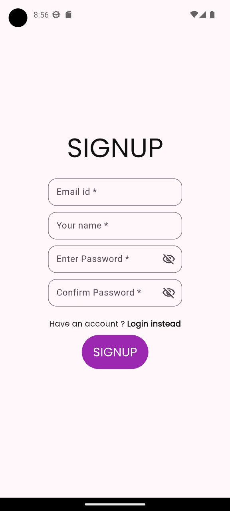
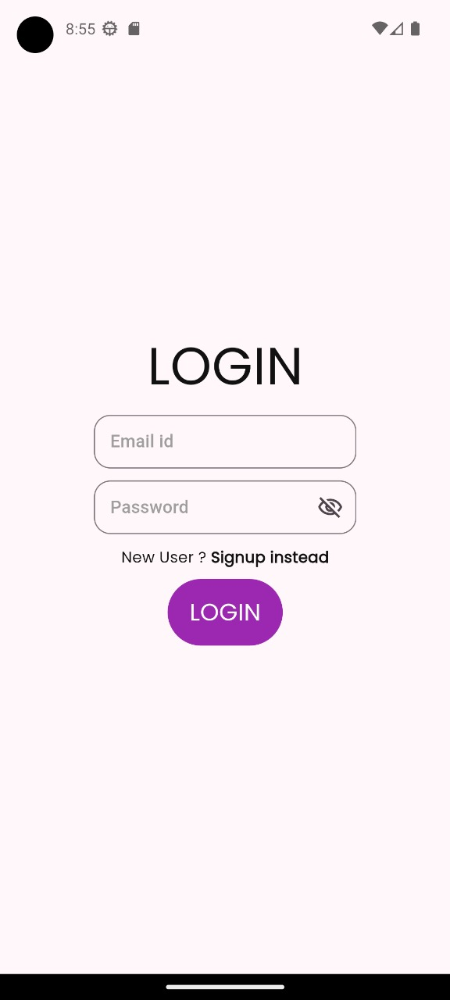
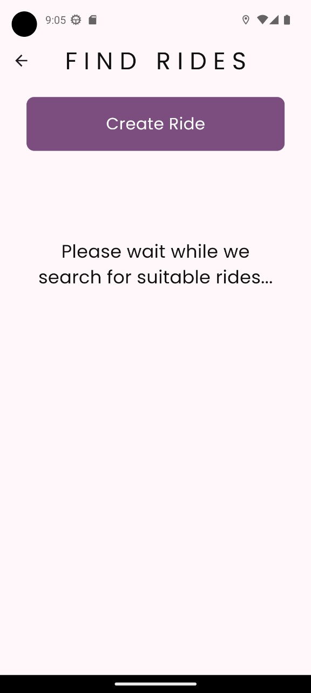
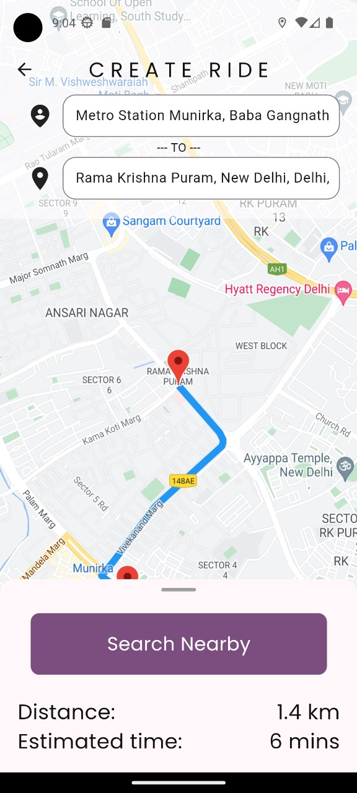
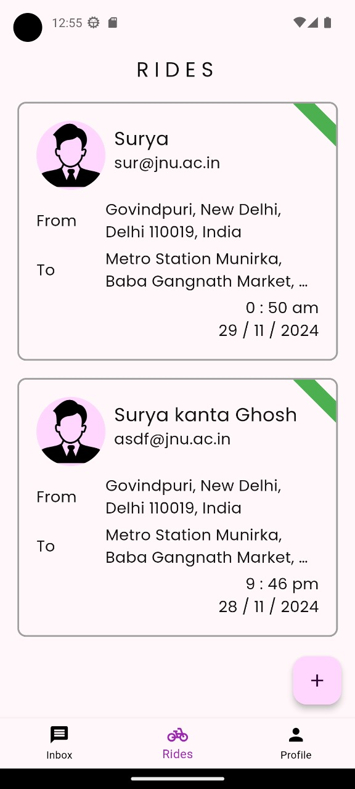
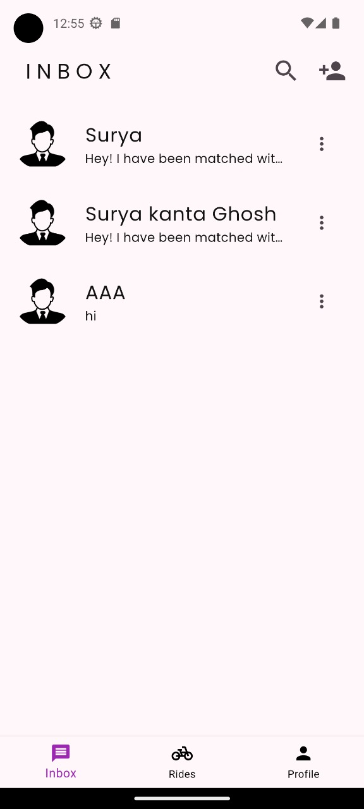
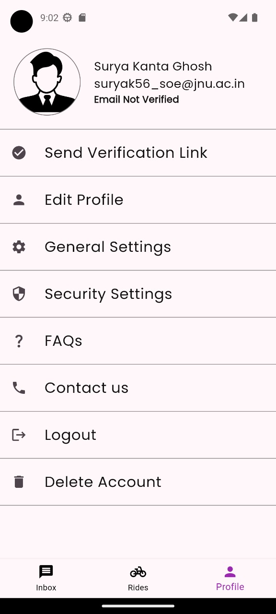

# Shared Commute 🚗

Shared Commute is a mobile application developed as part of our **7th Semester Minor Project**. This app aims to facilitate ride-sharing among students, allowing them to find and connect with others traveling along similar routes. By leveraging Firebase and Google Maps APIs, Shared Commute provides a seamless, real-time, and user-friendly solution for ride-sharing.

---

## Table of Contents

- [Shared Commute 🚗](#shared-commute-)
  - [Table of Contents](#table-of-contents)
  - [Project Overview](#project-overview)
  - [Objectives](#objectives)
  - [Features](#features)
  - [Technical Details](#technical-details)
    - [Framework and Technologies](#framework-and-technologies)
    - [Database Design](#database-design)
  - [App Screenshots](#app-screenshots)
  - [Development Methodology](#development-methodology)
    - [Requirement Analysis and Planning](#requirement-analysis-and-planning)
    - [System Design](#system-design)
    - [App Development](#app-development)
    - [Testing and Debugging](#testing-and-debugging)
    - [Deployment](#deployment)
  - [Future Work](#future-work)
    - [Deployment](#deployment-1)
  - [Contributing](#contributing)
  - [License](#license)
  - [Conclusion](#conclusion)

---

## Project Overview

Shared Commute revolutionizes the way students commute by providing a platform for ride-sharing. The app focuses on reducing transportation costs, fostering community connections, and contributing to eco-friendly travel.

---

## Objectives

- Define core features and functionality for an efficient ride-sharing app.
- Conduct surveys to understand user needs and preferences.
- Design and develop a scalable, user-friendly application.
- Implement real-time route-matching algorithms and Firebase-based database management.
- Provide secure login with Firebase Authentication.

---

## Features

- **User Authentication**: Secure user registration and login via Firebase Authentication.
- **Post and Search Rides**: Users can post available rides or search for suitable ones.
- **Real-Time Route Matching**: Matches rides based on origin, destination, and travel time.
- **Google Maps Integration**: Displays routes and calculates distance in real time.
- **Ride Details**: View ride-sharing options, including driver details and seat availability.
- **In App Chatting**: Users can chat among themselves and can plan their rides conveniently.

---

## Technical Details

### Framework and Technologies

- **Flutter**: Cross-platform app development for both Android and iOS.
- **Firebase**:
  - Real-time Database: For storing and syncing user and ride data.
  - Authentication: Secure login and registration.
  - Cloud Functions: For backend logic and notifications.
- **Google Maps API**: Map display, location tracking, and route visualization.
- **Ride-Matching Algorithm**:
  - Matches rides based on user-provided inputs such as origin, destination, and preferred travel time.
  - Optimized for efficiency and real-time results.

### Database Design

- **Firebase Realtime Database**:
  - User details: Name, contact, and profile data.
  - Ride information: Origin, destination, time, and seat availability.
  - Matching logic: Real-time queries for ride matches.

---

## App Screenshots

- **Signup Page**
  

---

- **Login Page**
  

---

- **Post Ride Page**
  

---

- **Search Ride Page**
  

---

- **Ride Details Page**
  

---

- **Inbox**
  

---

- **User Profile**
  

---

## Development Methodology

### Requirement Analysis and Planning

1. Defined core features: Ride posting, searching, and matching.
2. Conducted student surveys to gather user preferences.
3. Finalized system requirements, including UI/UX guidelines and security protocols.

### System Design

- **Architecture**: Designed a modular app architecture for scalability.
- **UI/UX**:
  - Developed wireframes and prototypes for intuitive navigation.
  - Focused on a student-friendly and minimalistic design.
- **Database Schema**:
  - Designed Firebase database schema for user and ride data.
  - Optimized for real-time updates and scalability.
- **Algorithm Design**:
  - Created a route-matching algorithm to match users with similar travel preferences.

### App Development

- Built the application using **Flutter**.
- Integrated Firebase for real-time database management and user authentication.
- Developed the route-matching algorithm and integrated it with Google Maps for route visualization.
- Implemented essential features like ride posting, searching, and viewing ride details.

### Testing and Debugging

- **Unit Testing**: Tested individual components such as authentication and database operations.
- **Integration Testing**: Verified smooth functioning of ride posting, matching, and searching.
- **User Acceptance Testing (UAT)**: Conducted tests with a sample group of students for feedback.

### Deployment

- Currently, The app is in development phase, so we are sharing the app as an apk and collecting user experriences and feedbacks for furthur improvements.

---

## Future Work

### Deployment

- **In-App Payment**: Add functionality for secure ride cost transactions.
- **Platform Expansion**: Extend the app to other campuses and communities.
- **AI Integration**: Use AI and ML to improve route-matching algorithms and predict user preferences.
- **Additional Features**: Incorporate real-time chat, notifications, and ride-sharing history.
- **Deployment**: - Deployed the app on the **Google Play Store** and **Apple App Store**.

---

## Contributing

We welcome contributions to improve the Shared Commute project! If you're interested, please fork the repository, make changes, and submit a pull request.

---

## License

This project is licensed under the [MIT License](./LICENSE).

---

## Conclusion

Shared Commute aims to redefine how students travel by creating an eco-friendly, community-driven ride-sharing platform. We strive to improve the commuting experience with innovative features and cutting-edge technology.

---
